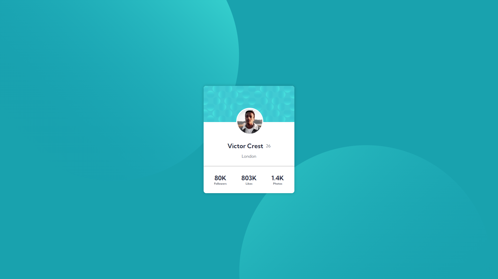

# Frontend Mentor - Profile card component solution

This is a solution to the [Profile card component challenge on Frontend Mentor](https://www.frontendmentor.io/challenges/profile-card-component-cfArpWshJ). Frontend Mentor challenges help you improve your coding skills by building realistic projects.

## Table of contents

- [Overview](#overview)
  - [Screenshot](#screenshot)
  - [Links](#links)
- [My process](#my-process)
  - [Built with](#built-with)
- [Author](#author)

## Overview

### Screenshot

### Links

- Solution URL: [Click Here](https://github.com/curiousdilip/frontend-mentor/tree/main/beginner/profile-card-component)
- Live Site URL: [See Live Here](https://curiousdilip.github.io/frontend-mentor/beginner/profile-card-component/index.html)

## My process

### Built with

- Semantic HTML5 markup
- Flexbox

## Author

- Website - [www.dilipmaurya.in](https://www.dilipmaurya.in)
- Frontend Mentor - [@curiousdilip](https://www.frontendmentor.io/profile/curiousdilip)
- Twitter - [@curiousdilip](https://www.twitter.com/curiousdilip)
