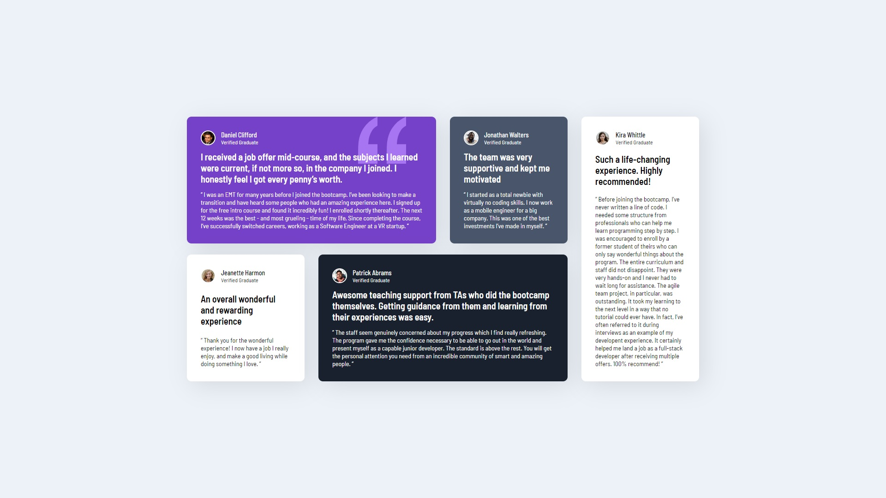

# Frontend Mentor - Testimonials grid section solution

This is a solution to the [Testimonials grid section challenge on Frontend Mentor](https://www.frontendmentor.io/challenges/testimonials-grid-section-Nnw6J7Un7). Frontend Mentor challenges help you improve your coding skills by building realistic projects.

## Table of contents

- [Overview](#overview)
  - [The challenge](#the-challenge)
  - [Screenshot](#screenshot)
  - [Links](#links)
- [My process](#my-process)
  - [Built with](#built-with)
- [Author](#author)

## Overview

### The challenge

Users should be able to:

- View the optimal layout depending on their device's screen size
- See hover states for interactive elements

### Screenshot

### Links

- Solution URL: [Click Here](https://github.com/curiousdilip/frontend-mentor/tree/main/junior/testimonials-grid-section-main)
- Live Site URL: [See Live Here](https://curiousdilip.github.io/frontend-mentor/junior/testimonials-grid-section-main/index.html)

## My process

### Built with

- Semantic HTML5 markup
- CSS custom properties
- Flexbox
- CSS Grid

## Author

- Website - [Dilip Kumar Maurya](https://www.dilipmaurya.in)
- Frontend Mentor - [@curiousdilip](https://www.frontendmentor.io/profile/curiousdilip)
- Twitter - [@curiousdilip](https://www.twitter.com/curiousdilip)
